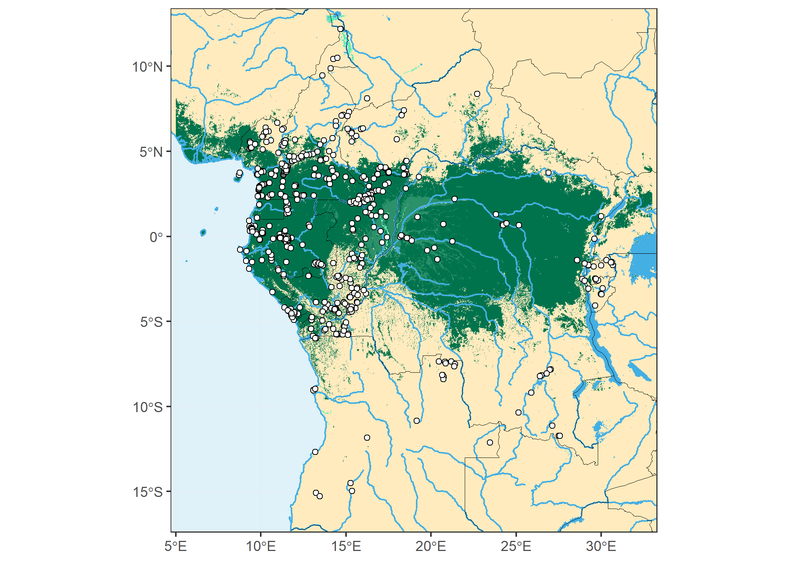

aDRAC (*Archives des datations radiocarbone d'Afrique centrale*)
================================================================

*[Dirk Seidensticker M.A. (Ghent University)](https://research.flw.ugent.be/en/dirk.seidensticker)*

The *archive for radiocarbon datings from Central Africa* (aDRAC) provides a catalogue of available radiocarbon datings from Central Africa. The dataset covers published radiocarbon dates and the most essential metadata for each date as well as available citations.

The [aDRAC-Webapp](https://dirkseidensticker.shinyapps.io/webapp/) will help you to explore the dataset.

The [radiocarbon5-Web-App](https://nevrome.shinyapps.io/radiocarbon5/) of [Clemens Schmid](https://github.com/nevrome) provides another overview. The data are compiled through an [custom module](https://github.com/nevrome/neolithicR/blob/master/modules/aDRAC/data_processor.R).

Structure of the Repository
---------------------------

| Folder    | Description                                                     |
|-----------|-----------------------------------------------------------------|
| /aDRACweb | Files for a Shiny-Webapp which helps to explore the dataset     |
| /data     | Contains the dataset itself as well as a description (.md file) |
| /Python   | Examples of Python-Code                                         |
| /R        | Examples of R-Code                                              |

Main Dataset **adrac.csv**
--------------------------

The main dataset is to be found within `/data/adrac.csv` The csv-file is encoded in 'UTF-8'. Geocoordinates are storred as longitude (`LONG`) and latitude (`LAT`).

The literature used to compile the dataset is to be found within the `data/SOURCES.md` file.

| Datafield    | Description                                                  |
| ------------ | ------------------------------------------------------------ |
| LABNR        | Laboratory number; all spaces where changed/unified to dashes |
| C14AGE       | Carbon-14 Age                                                |
| C14STD       | Standard deviation                                           |
| C13          | Carbon-13 amount                                             |
| MATERIAL     | Dated Material                                               |
| SITE         | Name of the Site                                             |
| COUNTRY      | [ISO 3166-1 alpha-3](https://en.wikipedia.org/wiki/ISO_3166-1) three-letter country code |
| FEATURE      | Designation of the Feature                                   |
| FEATURE_DESC | Category of the Feature                                      |
| PHASE        | Basic chronological association                              |
| POTTERY      | Associated pottery styles; see [List of style groups](https://github.com/dirkseidensticker/nwCongo/blob/master/bib/StilGrChrono.csv) |
| REL          | Reliability of the context of a date and if it should be used for archaeological questions (e.g. settlement history); 0 not to be relied on; 1 reliable |
| LAT          | Latitude as decimal degrees 1                     |
| LONG         | Longitude as decimal degrees 1                    |
| DEPTH        | Depth below surface in meters. In case that the original source only gave a range, then the mean depth has been recorded. |
| SOURCE       | Source                                                       |

---

1 All geo-coordinates included within aDRAC are either obtained from the published sources that contained the radiocarbon dates itself or were derived by searching for the name of the site within [geonames.org](http://www.geonames.org/)

### Coordinates

If published the coordinates were converted into WGS84 (EPSG:4326). If no coordinates were published of the site, coordinates were retrieved from [GeoNames](http://www.geonames.org/).

c14bazAAR
---------

The aDRAC dataset can be accessed and analyzed using the [c14bazAAR R-Package](https://github.com/ISAAKiel/c14bazAAR). c14bazAAR enables basic data cleaning and calibration.

The c14bazAAR-parser for aDRAC can be found [here](https://github.com/ISAAKiel/c14bazAAR/blob/master/R/get_adrac.R)

License
-------

The aDRAC-dataset (inside /data) is made available under the [Open Database License](http://opendatacommons.org/licenses/odbl/1.0/). Any rights in individual contents of the database are licensed under the [Database Contents License](http://opendatacommons.org/licenses/dbcl/1.0/). All source code is licensed under the [MIT license](http://opensource.org/licenses/mit-license.php).

Citation
--------

Seidensticker, D. (2016), ‘aDRAC. Archives des datations radiocarbone d'Afrique centrale’, Version 0.1 <https://github.com/dirkseidensticker/aDRAC>.
