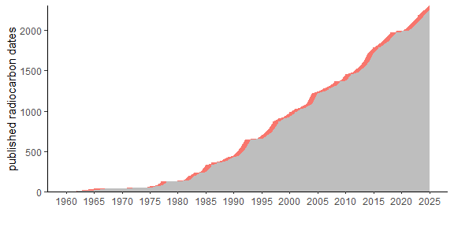

# aDRAC (*Archive des datations radiocarbones d’Afrique centrale*)

**Dirk Seidensticker** & **Wannes Hubau**

The *archive for radiocarbon datings from Central Africa* (aDRAC)
provides a catalogue of available radiocarbon dates from Central Africa.
The data cover published radiocarbon dates and essential metadata for
each date as well as available references.

The data cover 1856 radiocarbon dates from 589 sites:

Dates are available for the past up to 40.000 years, but the bulk of
dates fall into the last three millennia:

Radiocarbon dates are reported since the 1960s and the record has
increased steadily since then:

The bulk of available dates have been produced before the advent of AMS
dating. Be aware, the archive contains also a small quantity of TL
dates:

The [aDRAC-Webapp](https://dirkseidensticker.shinyapps.io/aDRACweb/)
will help you to explore the dataset.

## Main Dataset **adrac.csv**

The main dataset is to be found within `/data/adrac.csv` The csv-file is
encoded in ‘UTF-8’. Geocoordinates are storred as longitude (`LONG`) and
latitude (`LAT`).

| Datafield     | Description                                                                                                                                                                                                                                                                                                                                                                                                                                                                                                                            |
|---------------|----------------------------------------------------------------------------------------------------------------------------------------------------------------------------------------------------------------------------------------------------------------------------------------------------------------------------------------------------------------------------------------------------------------------------------------------------------------------------------------------------------------------------------------|
| LABNR         | Laboratory number; all spaces where changed/unified to dashes                                                                                                                                                                                                                                                                                                                                                                                                                                                                          |
| C14AGE        | Carbon-14 Age                                                                                                                                                                                                                                                                                                                                                                                                                                                                                                                          |
| C14STD        | Standard deviation                                                                                                                                                                                                                                                                                                                                                                                                                                                                                                                     |
| C13           | Carbon-13 amount                                                                                                                                                                                                                                                                                                                                                                                                                                                                                                                       |
| METHOD        | Dating method (convention, bulk, AMS)                                                                                                                                                                                                                                                                                                                                                                                                                                                                                                  |
| MATERIAL      | Dated Material                                                                                                                                                                                                                                                                                                                                                                                                                                                                                                                         |
| COUNTRY       | [ISO 3166-1 alpha-3](https://en.wikipedia.org/wiki/ISO_3166-1) three-letter country code                                                                                                                                                                                                                                                                                                                                                                                                                                               |
| SITE          | Name of the Site                                                                                                                                                                                                                                                                                                                                                                                                                                                                                                                       |
| FEATURE       | Designation of the Feature                                                                                                                                                                                                                                                                                                                                                                                                                                                                                                             |
| FEATURE\_DESC | Category of the Feature                                                                                                                                                                                                                                                                                                                                                                                                                                                                                                                |
| DEPTH         | Depth below surface in meters. In case that the original source only gave a range, then the mean depth has been recorded.                                                                                                                                                                                                                                                                                                                                                                                                              |
| LAT           | Latitude as decimal degrees                                                                                                                                                                                                                                                                                                                                                                                                                                                                                                            |
| LONG          | Longitude as decimal degrees                                                                                                                                                                                                                                                                                                                                                                                                                                                                                                           |
| PHASE         | General chronological phase (**Attention** gives no allocation to associated finds or representativeness)                                                                                                                                                                                                                                                                                                                                                                                                                              |
| LITHICS       | Associated lithic finds                                                                                                                                                                                                                                                                                                                                                                                                                                                                                                                |
| POTTERY       | Associated pottery with name of the styl. Multiple style groups associated with the same date are separated by semicolon, synonym styles are separated by dash with the more specific/recent name first. Styles in parantheses (e.g. *(Imbonga)*) mean that pottery of that style was found in association with this date, but that based on the discussion in the literature, the date is not representing the age of this pottery. *indet* mean up to now not sufficiently described pottery was found in association with this date |
| IRON          | Associated iron finds                                                                                                                                                                                                                                                                                                                                                                                                                                                                                                                  |
| FRUIT         | Associated fruit remains                                                                                                                                                                                                                                                                                                                                                                                                                                                                                                               |
| ZOO           | Associated archaeozoological remains                                                                                                                                                                                                                                                                                                                                                                                                                                                                                                   |
| CLASS         | Classification of reliability following [Seidensticker et al. 2021 (table S1)](https://advances.sciencemag.org/content/7/7/eabd8352)                                                                                                                                                                                                                                                                                                                                                                                                   |
| REMARK        | Additional remarks                                                                                                                                                                                                                                                                                                                                                                                                                                                                                                                     |
| SOURCES       | Source                                                                                                                                                                                                                                                                                                                                                                                                                                                                                                                                 |

The literature used to compile the dataset is to be found within the
`SOURCES.md` file.

### Coordinates

All geo-coordinates included within **aDRAC** are either obtained from
the published sources that contained the radiocarbon dates itself or
were derived by searching for the name of the site in
[geonames.org](http://www.geonames.org/). If published the coordinates
were converted into WGS84 (EPSG:4326). Coordinates are rounded to three
degrees, giving a rough precision of about 100m.

## c14bazAAR

The data are accessible through the
[c14bazAAR](https://github.com/ropensci/c14bazAAR) of [Clemens
Schmid](https://github.com/nevrome) *et al.* through a **custom module**
(`c14bazAAR::get_c14data("adrac")`).

## License

The aDRAC-dataset is made available under the [Open Database
License](http://opendatacommons.org/licenses/odbl/1.0/). Any rights in
individual contents of the database are licensed under the [Database
Contents License](http://opendatacommons.org/licenses/dbcl/1.0/).

## How to cite

Seidensticker, D. & W. Hubau (2021), ‘aDRAC. Archive des datations
radiocarbones d’Afrique centrale’, Version 2.0
<https://github.com/dirkseidensticker/aDRAC>.

## Case Studies using aDRAC

-   Seidensticker, D., W. Hubau, D. Verschuren, C. Fortes-Lima, P. de
    Maret, C.M. Schlebusch & K. Bostoen. 2021. Population Collapse in
    Congo Rainforest from AD 400 Urges Reassessment of the Bantu
    Expansion. Science Advances.

-   Power, R.C., T. Güldemann, A. Crowther & N. Boivin. 2019. Asian Crop
    Dispersal in Africa and Late Holocene Human Adaptation to Tropical
    Environments. Journal of World Prehistory.
    <http://link.springer.com/10.1007/s10963-019-09136-x>.
    <https://doi.org/10.1007/s10963-019-09136-x>.
